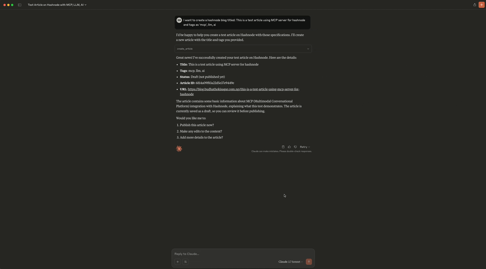

# Hashnode MCP Server

A Model Context Protocol (MCP) server for interacting with the Hashnode API. This server provides tools for accessing and searching Hashnode content programmatically.

## Demo
- Create Article
   
- Update Article
   

## Features

- Creating and publishing new articles
- Updating existing articles
- Searching for articles by keywords
- Retrieving article details
- Getting user information
- Fetching the latest articles from a publication

## Installation

1. Clone the repository:
   ```bash
   git clone https://github.com/sbmagar13/hashnode-mcp-server.git
   cd hashnode-mcp-server
   ```

2. Create a virtual environment and activate it:
   ```bash
   python -m venv .venv
   source .venv/bin/activate  # On Windows, use: .venv\Scripts\activate
   ```

3. Install the dependencies:
   ```bash
   pip install -r requirements.txt
   ```

4. Create a `.env` file in the root directory with your Hashnode API credentials:
   ```
   HASHNODE_PERSONAL_ACCESS_TOKEN=your_personal_access_token
   HASHNODE_API_URL=https://gql.hashnode.com
   ```

## Usage

### Starting the Server

You have two options for running the server:

#### Option 1: Run the server manually

```bash
python run_server.py
```

Or directly using the root file:

```bash
python mcp_server.py
```

The server will start and listen for connections from AI assistants. By default, it runs on `localhost:8000` using the Server-Sent Events (SSE) transport protocol.

#### Option 2: Let the MCP integration handle it automatically

When properly configured in Claude Desktop or Cline VSCode extension, the MCP integration will automatically start and manage the server process for you.

### Important Note on File Structure

When configuring your MCP server in Claude Desktop or Cline VSCode extension, you should use the root `mcp_server.py` file directly rather than the files in the `hashnode_mcp` directory. The `hashnode_mcp` directory is primarily for packaging purposes.

### Available Tools

The server provides the following tools:

- `test_api_connection()`: Test the connection to the Hashnode API
- `create_article(title, body_markdown, tags="", published=False)`: Create and publish a new article on Hashnode
- `update_article(article_id, title=None, body_markdown=None, tags=None, published=None)`: Update an existing article on Hashnode
- `get_latest_articles(hostname, limit=10)`: Get the latest articles from a Hashnode publication by hostname
- `search_articles(query, page=1)`: Search for articles on Hashnode
- `get_article_details(article_id)`: Get detailed information about a specific article
- `get_user_info(username)`: Get information about a Hashnode user

### Using the MCP Server

Once the server is running, you can use it with AI assistants that support the Model Context Protocol (MCP), such as Claude. The assistant will be able to use the tools provided by the server to interact with the Hashnode API.

The tools can be used to:
- Test the API connection
- Create and publish new articles
- Update existing articles
- Get the latest articles from a publication
- Search for articles
- Get detailed information about specific articles
- Get information about users

## Configuring MCP on Claude Desktop and Cline VSCode Extension

### Cline VSCode Extension

1. Navigate to the Cline MCP settings file:
   - Windows: `%APPDATA%\Code\User\globalStorage\saoudrizwan.claude-dev\settings\cline_mcp_settings.json`
   - macOS: `~/Library/Application Support/Code/User/globalStorage/saoudrizwan.claude-dev/settings\cline_mcp_settings.json`
   - Linux: `Unfortunately, Claude Desktop is not available for Linux as of now` (You can use Cline extension instead)

2. Add your Hashnode MCP server configuration:
   ```json
   {
     "mcpServers": {
       "hashnode": {
         "command": "/path/to/your/venv/bin/python",
         "args": [
           "/path/to/your/hashnode-mcp-server/mcp_server.py"
         ],
         "env": {
           "HASHNODE_PERSONAL_ACCESS_TOKEN": "your-personal-access-token"
         }
       }
     }
   }
   ```

### Claude Desktop

1. Navigate to the configuration file:
   - Windows: `%APPDATA%\Claude\claude_desktop_config.json`
   - macOS: `~/Library/Application Support/Claude/claude_desktop_config.json`

2. Add your Hashnode MCP server configuration using the same format as above.

### Troubleshooting Connection Issues

If you encounter connection issues:
- Verify the server is running
- Check the paths in your configuration
- Ensure your environment variables are properly set
- Check the server logs for any error messages
- Try restarting both the MCP server and the Claude application

## Environment Variables

- `HASHNODE_PERSONAL_ACCESS_TOKEN`: Your Hashnode personal access token
- `HASHNODE_API_URL`: The Hashnode GraphQL API URL (default: https://gql.hashnode.com)

## Contributing

Contributions are welcome! Please feel free to submit a Pull Request.

1. Fork the repository
2. Create your feature branch (`git checkout -b feature/amazing-feature`)
3. Commit your changes (`git commit -m 'Add some amazing feature'`)
4. Push to the branch (`git push origin feature/amazing-feature`)
5. Open a Pull Request

## License

This project is licensed under the MIT License - see the [LICENSE](LICENSE) file for details.

## GitHub Repository

The source code for this project is available on GitHub:
https://github.com/sbmagar13/hashnode-mcp-server

## Technical Architecture

The project is organized with a clean, modular structure:

- `mcp_server.py`: Root server implementation that can be run directly
- `hashnode_mcp/`: Core package containing the modular functionality
  - `mcp_server.py`: Package version of the server implementation
  - `utils.py`: Utility functions for formatting responses and GraphQL queries
- `run_server.py`: Entry point for running the server using the package version

The server uses asynchronous programming with Python's `asyncio` and `httpx` libraries for efficient API communication. GraphQL queries and mutations are defined as constants, making them easy to maintain and update.

## Future Enhancements

Planned future developments include:

- Additional Hashnode features (comments, series, newsletters)
- Analytics integration
- Content optimization
- Multi-user support
- Webhook support

## Acknowledgments

- [Hashnode](https://hashnode.com/) for providing the API
- [Model Context Protocol (MCP)](https://github.com/modelcontextprotocol/mcp) for the server framework
