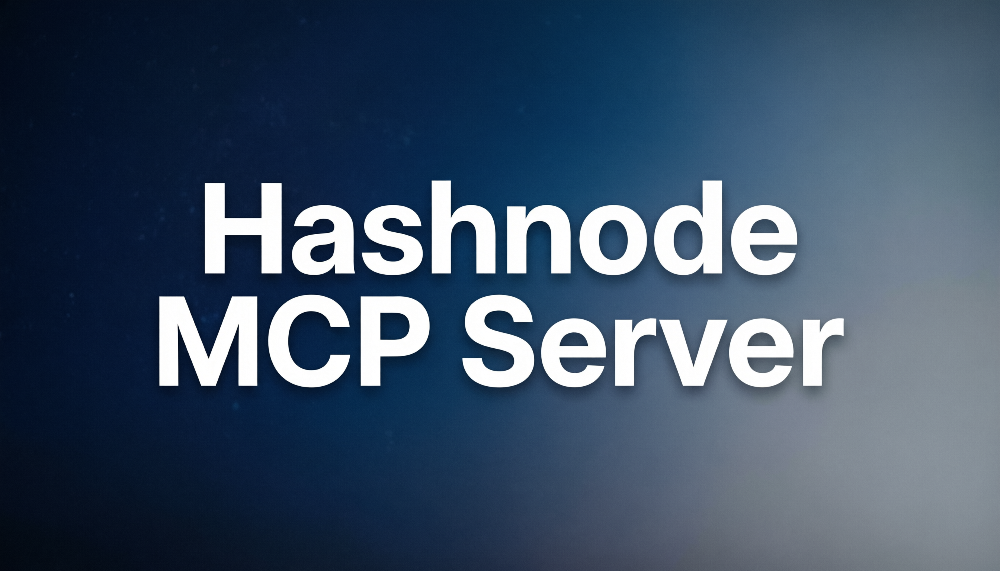
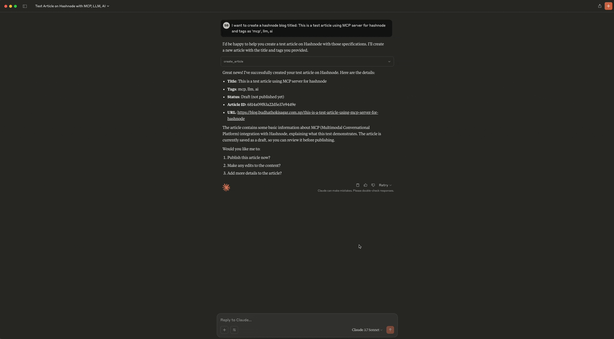

[](https://mseep.ai/app/sbmagar13-hashnode-mcp-server)

# Hashnode MCP Server

A Model Context Protocol (MCP) server for interacting with the Hashnode API. This server provides tools for accessing, creating, managing, and searching Hashnode content programmatically.



## Demo
- Create Article
   
- Update Article
   

## Features

- Creating, updating, and deleting articles
- Publishing drafts
- Searching for articles by keywords
- Retrieving article details
- Getting user information and articles by user
- Fetching latest articles from a publication
- Browsing top/trending articles on Hashnode
- Filtering articles by tag
- Following/unfollowing users
- Managing webhooks for publication events

## Installation

1. Clone the repository:
   ```bash
   git clone https://github.com/sbmagar13/hashnode-mcp-server.git
   cd hashnode-mcp-server
   ```

2. Create a virtual environment and activate it:
   ```bash
   python -m venv .venv
   source .venv/bin/activate  # On Windows, use: .venv\Scripts\activate
   ```

3. Install the dependencies:
   ```bash
   pip install -r requirements.txt
   ```

4. Create a `.env` file in the root directory with your Hashnode API credentials:
   ```
   HASHNODE_PERSONAL_ACCESS_TOKEN=your_personal_access_token
   HASHNODE_API_URL=https://gql.hashnode.com
   ```

## Usage

### Starting the Server

You have two options for running the server:

#### Option 1: Run the server manually

```bash
python run_server.py
```

Or directly using the root file:

```bash
python mcp_server.py
```

The server uses **stdio transport** by default, which is the standard for MCP servers. It communicates via stdin/stdout with the MCP client (e.g., Claude Desktop, Cline VSCode extension).

#### Option 2: Let the MCP integration handle it automatically

When properly configured in Claude Desktop or Cline VSCode extension, the MCP integration will automatically start and manage the server process for you.

### Important Note on File Structure

When configuring your MCP server in Claude Desktop or Cline VSCode extension, you should use the root `mcp_server.py` file directly rather than the files in the `hashnode_mcp` directory. The `hashnode_mcp` directory is primarily for packaging purposes.

### Available Tools

The server provides the following tools:

#### Article Management
- `create_article(title, body_markdown, tags="", published=False)`: Create and publish a new article on Hashnode
- `update_article(article_id, title=None, body_markdown=None, tags=None, published=None)`: Update an existing article on Hashnode
- `delete_article(article_id)`: Delete an article on Hashnode
- `publish_draft(draft_id)`: Publish an existing draft article

#### Article Discovery
- `get_latest_articles(hostname, limit=10)`: Get the latest articles from a Hashnode publication by hostname
- `search_articles(query, page=1)`: Search for articles on Hashnode
- `get_article_details(article_id)`: Get detailed information about a specific article
- `get_articles_by_username(username, limit=10)`: Get articles by a specific user
- `get_top_articles(limit=10)`: Get top/trending articles from Hashnode global feed
- `get_articles_by_tag(tag, limit=10)`: Get articles filtered by tag
- `get_publication_posts(hostname, limit=10)`: Get posts from a publication by hostname

#### User Management
- `get_user_info(username)`: Get information about a Hashnode user
- `toggle_follow_user(username)`: Follow or unfollow a Hashnode user

#### Webhooks
- `create_webhook(publication_id, url, events, secret)`: Create a webhook for a publication

#### Utilities
- `test_api_connection()`: Test the connection to the Hashnode API

## Configuring MCP on Claude Desktop and Cline VSCode Extension

### Cline VSCode Extension

1. Navigate to the Cline MCP settings file:
   - Windows: `%APPDATA%\Code\User\globalStorage\saoudrizwan.claude-dev\settings\cline_mcp_settings.json`
   - macOS: `~/Library/Application Support/Code/User/globalStorage/saoudrizwan.claude-dev/settings\cline_mcp_settings.json`
   - Linux: `~/.config/Code/User/globalStorage/saoudrizwan.claude-dev/settings/cline_mcp_settings.json`

2. Add your Hashnode MCP server configuration:
   ```json
   {
     "mcpServers": {
       "hashnode": {
         "command": "/path/to/your/venv/bin/python",
         "args": [
           "/path/to/your/hashnode-mcp-server/mcp_server.py"
         ],
         "env": {
           "HASHNODE_PERSONAL_ACCESS_TOKEN": "your-personal-access-token"
         }
       }
     }
   }
   ```

### Claude Desktop

1. Navigate to the configuration file:
   - Windows: `%APPDATA%\Claude\claude_desktop_config.json`
   - macOS: `~/Library/Application Support/Claude/claude_desktop_config.json`

2. Add your Hashnode MCP server configuration using the same format as above.

### Troubleshooting Connection Issues

If you encounter connection issues:
- Verify the server is running
- Check the paths in your configuration
- Ensure your environment variables are properly set
- Check the server logs (output to stderr) for any error messages
- Try restarting both the MCP server and the Claude application

## Environment Variables

- `HASHNODE_PERSONAL_ACCESS_TOKEN`: Your Hashnode personal access token
- `HASHNODE_API_URL`: The Hashnode GraphQL API URL (default: https://gql.hashnode.com)

## Contributing

Contributions are welcome! Please feel free to submit a Pull Request.

1. Fork the repository
2. Create your feature branch (`git checkout -b feature/amazing-feature`)
3. Commit your changes (`git commit -m 'Add some amazing feature'`)
4. Push to the branch (`git push origin feature/amazing-feature`)
5. Open a Pull Request

## License

This project is licensed under the MIT License - see the [LICENSE](LICENSE) file for details.

## GitHub Repository

The source code for this project is available on GitHub:
https://github.com/sbmagar13/hashnode-mcp-server

## Technical Architecture

The project is organized with a clean, modular structure:

- `mcp_server.py`: Thin shim that re-exports from the package for backwards compatibility
- `hashnode_mcp/`: Core package containing all server logic
  - `mcp_server.py`: Canonical server implementation with all MCP tools
  - `utils.py`: Utility functions for formatting responses and GraphQL queries
- `run_server.py`: Entry point for running the server using the package version

The server uses asynchronous programming with Python's `asyncio` and `httpx` libraries for efficient API communication. GraphQL queries and mutations are defined as constants in `utils.py`, making them easy to maintain and update.

## Acknowledgments

- [Hashnode](https://hashnode.com/) for providing the API
- [Model Context Protocol (MCP)](https://github.com/modelcontextprotocol/mcp) for the server framework
- This is certified by [MCP Review](https://mcpreview.com/mcp-servers/sbmagar13/hashnode-mcp-server)
